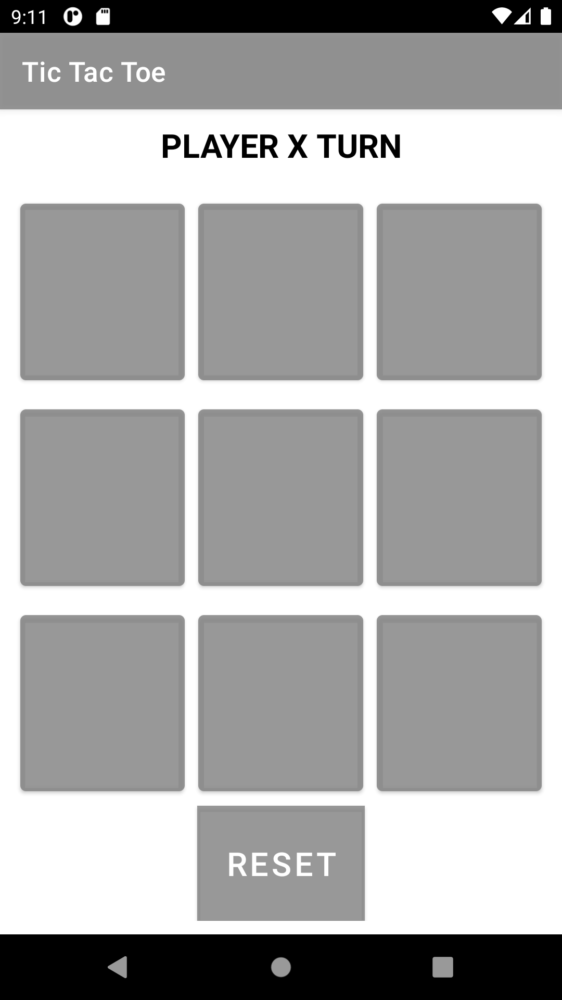
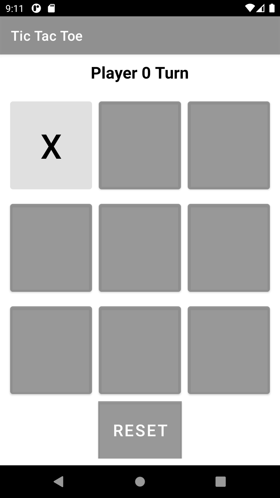
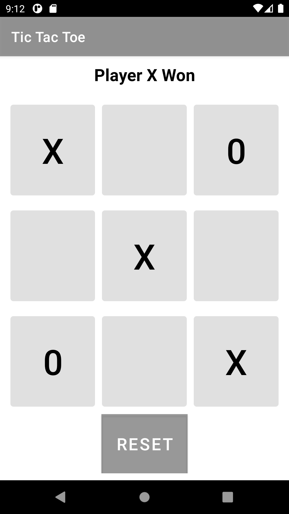

# TicTacToe
Tic Toc Toe using kotlin
 
 
| | | |
<!-- 

 -->
 
 
I have used XML & Kotlin for developing this game
 
In one move, players need to select one position in the 3×3 grid and put their mark at that place.
 
The game runs continuously until one may wins
 
As of now, this game has only OFFLINE mode
